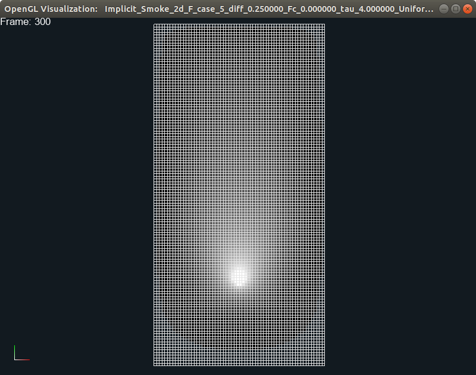
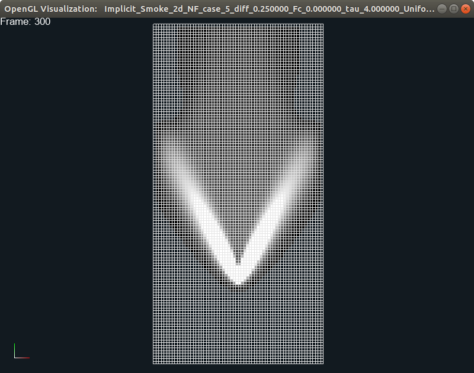
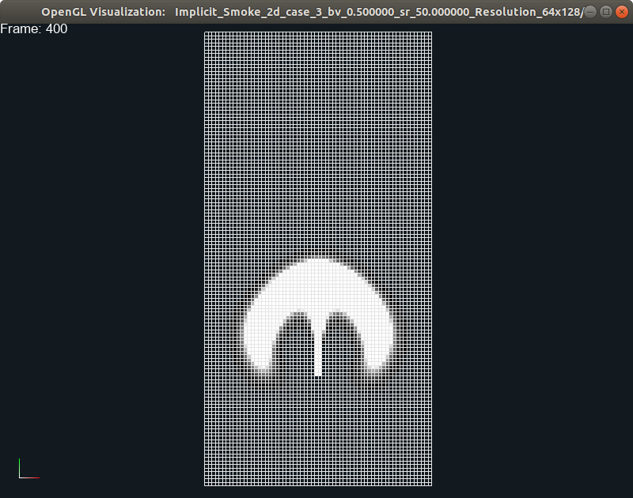
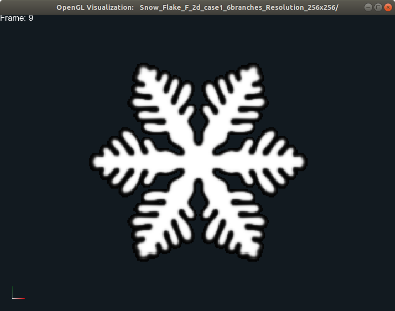
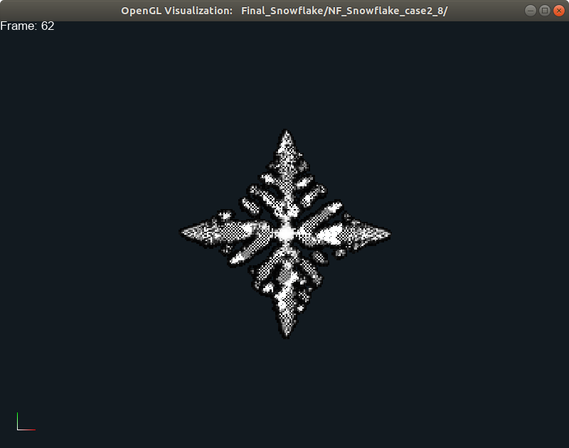

# A Novel Discretization and Numerical Solver for Non-Fourier Diffusion
 

## Description

This is the opensource code for SIGGRAPH Asia 2020 submission:

We introduce a generalized constitutive model for diffusion-driven problems with several attractive properties:
- It fundamentally explains diffusion from the perspective of the Boltzmann Transport Equation  
- It can address the issue of infinite propagation speed for diffusion, an assumption made by the widely employed Fick’s/Fourier’s law.
- It can capture some of the most characteristic, yet unprecedented, visual aspects of diffusion-driven physics.

In the algorithm, we propose a novel semi-implicit discretization for this diffusion model on staggered MACgrids and design a geometric Multigrid-preconditioned Conjugate Gradients solver for efficient numerical solution. 

## Compilation
The following instruction is tested on Ubuntu 18.04 LTS with g++7.5

### Dependencies
#### Install Nova library and OpenGL viewer
The Nova library can be downloaded from GitHub using the following command:
```
git clone https://github.com/OrionQuest/Nova.git
```
Example projects that use the Nova core library live in a separate repository, and can be downloaded using the following commands:
```
cd Nova/Projects
git clone https://github.com/OrionQuest/Nova_Examples.git
```
Nova depends on several libraries such as `GLM`,`FreeType`,`GLFW`,`GLEW`,`Boost`,`Assimp`, etc. Run the following command to install all the dependencies:
```
sudo apt-get install libboost1.62-dev libboost-program-options1.62-dev libboost-filesystem1.62-dev libboost-regex1.62-dev libglfw3-dev libglew-dev libglm-dev libassimp-dev libfreetype6-dev
```
The build system uses cmake (version 3.0 or higher). We recommend the use of the graphical version ccmake for easy configuration of the environment variables. The best way to install the latest version of cmake and ccmake is to first run the following command:
```
sudo apt-get install cmake
sudo apt-get install cmake-qt-gui
sudo apt-get install libncurses5-dev
```
#### Extract Project
Extract non_ficks_diffusion.zip to Nova/Projects. The partial directory should look like this:
```
.
+-- Projects 
|   +-- non_ficks_diffusion
|   +-- Nova_Examples
|   +-- CMakeLists.txt
...
```
### Build
Run the following commands in order:
```
cd Nova
mkdir build
cd build
ccmake ..
```
Set ``CMAKE_BUILD_TYPE`` to ``Release``, and turn ``OFF`` the following flags: ``ENABLE_OPENIMAGEIO_PLUGIN``, ``ENABLE_SOIL_PLUGIN``, 
``ENABLE_VARIATIONAL_FLUIDS``, ``USE_C11_REGEX``, ``USE_DOUBLES``.Turn all the other flags ``ON``. 
Press ``c`` to configure, and then ``g`` to generate the ``Makefile``. Finally, run the following command:
```
make -j 8
```
### Configure OpenGL
Run the following commands in order:
```
cd build/
ln -s ../Projects/Nova_Examples/opengl/example/nova.conf .
ln -s ../Projects/Nova_Examples/opengl/example/fonts/ .
ln -s ../Projects/Nova_Examples/opengl/plugins/Grid/shaders/ .
```
Choose the correct plugin for visualization in nova.conf in *Nova/build/*
#### For hydrogel visualization
``libplugin_Non_Ficks_Diffusion`` has been designed to visualize particles as well as the background grid.
```
...
#Plugin=libplugin_Embedded_Deformables
Plugin=libplugin_Non_Ficks_Diffusion
#Plugin=libplugin_Autonomous_Navigation
...
```
#### For other simulations
``libplugin_Autonomous_Navigation`` can be used to show volumetric data.
```
...
#Plugin=libplugin_Embedded_Deformables
#Plugin=libplugin_Non_Ficks_Diffusion
Plugin=libplugin_Autonomous_Navigation
...
```
Here are some of the command options for both plugins.
- ALT-P: planar camera
- P: play-pause
- S: next frame
- SHIFT-S: previous frame
- R: reset frame
- F2: show/hide background grid
- Scroll: zoom in/out
- Left-mouse: rotate
- Right-mouse: translate
## Demos
### Smoke
#### With Fourier Diffusion
Go to the build directory (*Nova/build/*), run the following command for Fourier diffusion test case:
```
./bin/non_ficks_smoke_3d -threads 8 -last_frame 500 -test_number 3 -diff_coeff 0.01 -bv 1 -sr 50 -size 256 512 256 -mg_levels 4 -ficks
```
Set plugin to be ``libplugin_Autonomous_Navigation`` in ``Nova/build/nova.conf``. Use opengl viewer to check out the result, the diffusive smoke:
```
./bin/opengl Implicit_Smoke_3d_F_case_5_diff_0.250000_Fc_0.000000_tau_4.000000_Uniform_bv_0.500000_sr_50.000000_Resolution_64x128/
```

#### With Non-Fourier Diffusion
Go to the build directory (*Nova/build/*), run the following command for non-Fourier diffusion test case:
```
./bin/non_ficks_smoke_2d -threads 8 -last_frame 300 -diff_coeff 0.25 -fc 0 -tau 4 -bv 0.5 -sr 50  -size 64 128 -mg_levels 2 -test_number 5 
```
Set plugin to be ``libplugin_Autonomous_Navigation`` in ``Nova/build/nova.conf``. Use opengl viewer to check out the cone structure:
```
./bin/opengl Implicit_Smoke_2d_NF_case_5_diff_0.250000_Fc_0.000000_tau_4.000000_Uniform_bv_0.500000_sr_50.000000_Resolution_64x128/
```

#### Without Diffusion
Go to the build directory (*Nova/build/*), run the following command for smoke simulation without any diffusion:
```
./bin/non_ficks_smoke_3d -threads 8 -last_frame 500 -test_number 3 -bv 1 -sr 50 -size 256 512 256 -mg_levels 4 -nd
```
Set plugin to be ``libplugin_Autonomous_Navigation`` in ``Nova/build/nova.conf``. Use opengl viewer to check out the result:
```
./bin/opengl Implicit_Smoke_3d_case_3_bv_0.500000_sr_50.000000_Resolution_64x128/
```

Here are some of the command options:
- diff_coeff: the diffusion coeffient
- bv: background velocity. The velocity field is set to be along y-axis
- sr: source rate, the speed that we add source to the source region
- size: whole domain size
- mg_levels: multigrid levels
- ...

### Snowflake
Go to the build directory (*Nova/build/*), run commands for different test cases as below:
#### With Fourier Diffusion
```
 ./bin/snow_flake_2d -threads 8 -last_frame 200 -framerate 240 -omega 6 -taus 3e-4 -gamma 10 -K 2 -delta 1e-2 -eps_xy 1e-2 -ma 0.9 -SR 0 -rf 5e-2 -dt 1e-4 -size 256 256 -cw 3e-2  -ficks -ed
```
Set plugin to be ``libplugin_Autonomous_Navigation`` in ``Nova/build/nova.conf``. Go to the build directory(*Nova/build/*), and run the following command to view the result:
```
./bin/opengl Snow_Flake_F_2d_case1_6branches_Resolution_256x256/
```

#### With Non-Fourier Diffusion
```
./bin/snow_flake_2d -threads 8 -last_frame 120 -framerate 480 -omega 8 -taus 1e-5 -tau1 1e-2 -tau2 1e-4 -fc1 0 -fc2 0 -gamma 10 -K 5 -delta 1e-2 -eps_xy 1e-2 -ma 0.9 -rf 5e-2 -dt 1e-6 -size 256 256  -ed
```
Set plugin to be ``libplugin_Autonomous_Navigation`` in ``Nova/build/nova.conf``. Go to the build directory(*Nova/build/*), and run the following command to view the result:
```
./bin/opengl Snow_Flake_NF_2d_case1_8branches_Resolution_256x256/
```

### Coral Reef
Go to the build directory (*Nova/build/*), run the following command
```
./bin/dendrite_growth_3d -threads 8 -last_frame 500 -ficks -ed -framerate 240 -taus 3e-4 -gamma 10 -K 4 -delta 1e-2 -eps 1e-2 -ma 0.9 -rf 5e-2 -dt 1e-4 -size 120 200 120 -cw 3e-2
```
Set plugin to be ``libplugin_Autonomous_Navigation`` in ``Nova/build/nova.conf``. Go to the build directory(*Nova/build/*), and run the following command to view the result:
```
./bin/opengl Dendrite_Growth_F_3d_case1_Resolution_120x200x120/ 
```

### Hydrogel Dwelling
Go to the build directory (*Nova/build/*), run the following command
```
./bin/nfd_3d -test_number 1 -last_frame 10 -threads 8 -E 40 -nu 0.4 -diff_coeff 0.01 -eta 10 -fc 0 -tau 1 -size 512 512 512 -mg_levels 5 -n_s 400000 -min_dt 1e-6 -max_dt 1e-3 -nbw 3
```
